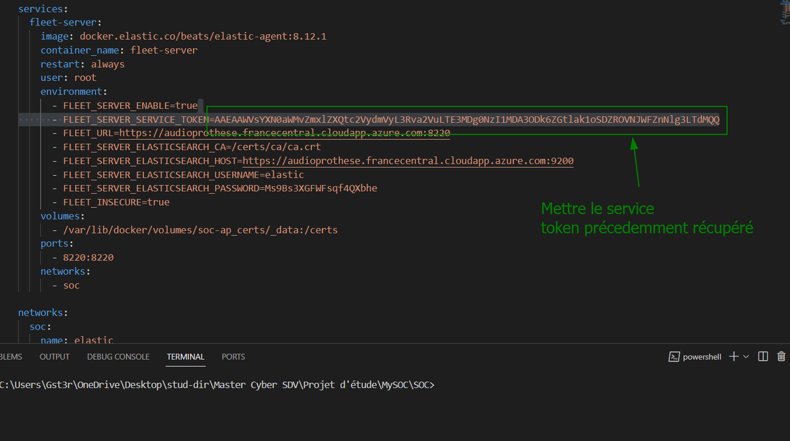

# SOC
Bienvenue sur le README du projet SOC !  
Il s'agit d'un projet d'étude permettant de lancer automatiquement grâce a Terraform et Ansible un environnement SOC.

## Prérequis

- 1 compte Azure avec suffisamment de crédit pour lancer l'environnement.
- 1 autorisation du propriétaire du dépôt pour accéder et récupérer ce dépôt
- Azure CLI installé en local avec une authentification paramétré.
- Terraform installé en local.
- Ansible installé en local (WSL si le déploiement est sur Windows).
- Ce dépôt cloné sur votre machine.

### Cloner le dépôt

cd /chemin/vers/mon/dossier/dépôt.git
git clone https://github.com/Gst3r/SOC.git

## Installer Azure CLI

Azure CLI est un outil en ligne de commande qui permet de communiquer avec l'ensemble de ses ressources cloud Azure. Sa puissance est ici utilisé pour automatiser la création de ressource via Terraform.

Rendez-vous ici : https://learn.microsoft.com/en-us/cli/azure/install-azure-cli-windows?tabs=azure-cli

### Configurer Azure CLI pour être authentifier

Rendez-vous ici : https://learn.microsoft.com/fr-fr/cli/azure/get-started-tutorial-1-prepare-environment?tabs=bash#sign-in-to-azure-using-the-azure-cli

## Installer Terraform

Terraform est un logiciel DevOps qui permet de rajouter une couche de logique à Azure CLI en permettant de récupérer, déployer et modifier des ressources grâce à un language de configuration spécifique à la technologie. L'univers du cloud est pratiquables depuis du code Terraform à travers l'infrastructure as code.

Terraform s'installe sur tous les systèmes donc aucun problème sur l'installation normalement. Il faut bien penser à vérifier le PATH pour que la variable d'environnement aille chercher l'executable au bon endroit, sinon, il faut déplacer le terraform.exe dans le dossier contenant les fichiers terraform.

Rendez-vous ici : https://developer.hashicorp.com/terraform/tutorials/aws-get-started/install-cli

## Installer Ansible

Ansible est une technologie qui permet d'automatiser la configuration de serveurs à travers une couche logique flexible, scalable, indempotente, facile et complètement open source.

Ansible s'installe le plus facilement par le biais de pip3 qui est l'installateur de paquets de python3. Il faut donc avoir la version 3 de python sur sa machine et faire attention à isoler le dépôt dans un environnement virtuel si un conflit de paquet apparaît avec un autre installateur de paquets comme apt ou yum.

Les documentations concernants python sont facilement trouvable sur le net donc pas de lien ici ;)

### Install Ansible on Windows

Ansible s'execute très bien sur Mac et Linux (OS de type UNIX), en revanche, il ne supporte pas l'utilisation de Windows. Pour déployer l'infra sur Windows, il faudra donc rajouter une couche en plus pour executer Ansible sur une machine Windows. La technologie la plus connue est WSL (Windows Sub-system for Linux) qui fonctionne comme une machine virtuelle très légère et qui se plug facilement à un environnement Windows car designé pour. WSL permet de lancer des systèmes et monte par défaut le lecteur de disque C: au chemin /mnt/c/.....

Pour installer WSL 2, rendez-vous ici : https://learn.microsoft.com/fr-fr/windows/wsl/install

Une fois WSL installé sur votre machine, vous pouvez passé à l'installation d'Ansible.

### Install Ansible on Linux, Red Hat, CentOS, MacOS, VM (Linux, Red Hat, CentOS)

Rendez-vous ici : https://docs.ansible.com/ansible/latest/getting_started/get_started_ansible.html


Une fois Ansible installé, positionnez vous dans le répertoire où vous avez cloné le dépôt.

**Sur Windows :**  Pour lancer WSL, il suffit juste de chercher l'application sur votre machine et de la lancer. Votre système de fichier Windows et monté au chemin /mnt/c/....

Attention ! Si la commande ansible --version retourne le message d'erreur "ERROR: Ansible requires the locale encoding to be UTF-8; Detected None." il faut taper les commandes suivantes pour corriger le problème : 
 ```
 export LC_CTYPE="en_US.UTF-8" && export LC_ALL="en_US.UTF-8"
 ```

### Extra

Vous pouvez également utiliser les moteurs, gestionnaires et orchestrateurs de conteneur (Docker, Docker Desktop, Kubernetes...) pour ce projet mais attention ! Il faut bien prendre en compte que le projet SOC n'a pas été pensé pour être déployé au moyen de docker, même si je reconnais que l'idée de déployer un environnement docker avec une environnement docker est très tentante.

Pareil pour l'automatisation du dépôt aux moyens des fonctionnalitées CICD de Gitlab, tout est faisable à ce niveau, mais cela demande des moyens DevOps qui n'ont pas été prévues pour ce projet.

## Intégration du SOC

### Configuration du mot de passe pour l'instance Azure

L'instance Azure est configuré avec un nom d'utilisateur, un mot de passe et une clé SSH. Il faut impérativement modifier le mot de passe par défaut qui est situé à la ligne 59 du fichier "main.tf". Pour modifier le nom d'utilisateur, il faut aller à la ligne 56 de ce même fichier.

### Configuration d'une clé SSH pour l'instance Azure

OpenSSH est requis sur le système pour générer la clé SSH.
Voici la commande à taper à la racine du dépôt en fonction de l'OS

**Sur Windows** 
```
ssh-keygen.exe -t rsa -b 4096
```
**Sur MacOS** 
```
ssh-keygen -t rsa -b 4096
```
**Sur Linux** 
```
ssh -t rsa -b 4096
```

Une fois la clé publique et privé généré vous pouvez les déplacer dans le dossier .ssh du dépôt cloné et renommer la clé publique soc.pub et la clé privé soc.key. La clé publique sera récupéré au moment du lancement de l'instance Azure et la clé privé permettera de vous connecter à l'instance à des fins de maintenance et de débugage.

### Déploiement de l'infrastructure avec Terraform

Pour déployer l'infrastructrure sur Azure, il faut se positionner à la racine du dépôt et taper les commandes suivantes : 

```
terraform init  
```
```
terraform fmt  
```
```
terraform validate  
```
```
terraform plan  
```
```
terraform apply  
```

Une fois la commande apply terminé, l'ip publique est récupérable en output de la commande. De cette façon, vous pourrez ping le serveur et vous connecter en SSH au serveur. La clé privé est présente dans le dossier .ssh au chemin .ssh/soc.key.

PS: si vous voulez détruire l'architecture SOC, la commande a effectuer est "terraform destroy".

### Configuration de l'infrastructure avec Ansible

A la racine du dépôt : 

Rendez-vous au fichier inventory.ini pour remplacer \<public-ip\> par l'ip de votre nouvelle instance provisionné précedemment.
Une fois le fichier modifié et sauvegardé, tapez la commande : 

```
echo "yes" | sudo ansible-playbook -i ./ansible_soc/inventory.ini ./ansible_soc/playbook.yaml
```
### Création des utilisateurs Cortex et n8n

Il faut accéder à [Cortex](http://audioprothese.francecentral.cloudapp.azure.com:9001) et suivre la procédure.

Il faut accéder à [n8n](http://audioprothese.francecentral.cloudapp.azure.com:5678) et suivre la procédure.

### Importation des automatisations pour le SOAR

### Wazuh2TheHive

### Elastic2TheHive

### Fleet Server et Elastic Agent + Integration Docker





### Elastic Rules

### Cortex Responders

## POC d'utilisation du SOC

### POC des ressources Azures

```
ping audioprothese.francecentral.cloudapp.azure.com
```

connexion SSH au serveur (les identifiants sont disponibles dans le fichier terraform main.tf - ligne 56 et 59)

### POC de l'installation des services SOC

**Le POC d'installation est un guide de test qui permettra une fois l'installation du SOC menés d'instaurer de vérifier que tous les services sont en bonne état de fonctionnement.**

connexion à Kibana : 
    - Direction [audioprothese.francecentral.cloudapp.azure.com:5601](http://audioprothese.francecentral.cloudapp.azure.com:5601) ou <public-ip>:5601
    - Se connecter grâce au nom d'utilisateur "**elastic**" et au mot de passe "**Ms9Bs3XGFWFsqf4QXbhe**".

connexion à TheHive : 
    - Direction [audioprothese.francecentral.cloudapp.azure.com:9000](http://audioprothese.francecentral.cloudapp.azure.com:9000) ou <public-ip>:9000
    - Se connecter grâce au nom d'utilisateur "**admin@thehive.local**" et au mot de passe "**secret**".
Vérifier que TheHive est connecté à Cortex : 
    - Logo Cortex en bas à gauche sur l'interface de TheHive a un contour vert
Vérifier que TheHive est connexté à MISP : 
    - Logo MISP en bas à gauche sur l'interface de TheHive a un contour vert

connexion à Cortex : 
    - Direction [audioprothese.francecentral.cloudapp.azure.com:9001](http://audioprothese.francecentral.cloudapp.azure.com:9001) ou <public-ip>:9001
    - Se connecter grâce aux identifiants de l'utilisateur racine que vous avez crée

connexion à n8n : 
    - Direction [audioprothese.francecentral.cloudapp.azure.com:5678](http://audioprothese.francecentral.cloudapp.azure.com:5678) ou <public-ip>:5678
    - Se connecter grâce aux identifiants de l'utilisateur racine que vous avez crée

connexion à Wazuh : 
    - Direction [audioprothese.francecentral.cloudapp.azure.com:5602](http://audioprothese.francecentral.cloudapp.azure.com:5602) ou <public-ip>:5602
    - Se connecter grâce au nom d'utilisateur "**kibanaserver**" et au mot de passe "**qdLkwUMd4dkLRMRTgZg4**".

Pensez bien à modifier les mots de passes par défaut de chaque service !!!

### POC de l'exploitation des services SOC

**Le POC d'exploitation est un guide de test qui permettra une fois les premières actions d'exploitations menés d'instaurer une routine de vérification du bon fonctionnement du SOC.**

check des Dashboards :
    - Kibana -> Analytics -> Dashboards

check de la section Management de Kibana :
    - check nomenclature
    - check des index de la base de donnée Elastic
    - check des datastream Elastic
    - check des component template et custom template
    - check des users, roles et permissions (SAML)
    - check des Ingest pipelines et des Logstash pipelines
check de la section Monitoring de Kibana : 
    - check du bon état des ressources de chaque noeud Elastic
    - check des logs d'erreurs
check du Discover pour la réception des logs
    - Listage des dataview
    - check de la reception
    - check de la pertinence des logs
check du Fleet Server :
    - Les agents sont up et en contact avec fleet server
    - Les agents remontent bie la donnée (check des indexs)
    - Les stratégies, intégrations et agents sont cohérents entre eux

check du SOAR :
    - check des workflows patterns
    - check des users, roles et permissions
    - check des running workflows

check de TheHive : 
    - users, roles et permissions (organisations)
    - check des responders/analyzes cortex
    - check des alertes / cases systems
check de Cortex : 
    - check des responders
    - check des analyzers
    - check de l'organisation, users et roles
    
Ce tuto est terminé ! Bonne exploitation !
